# Citation Network

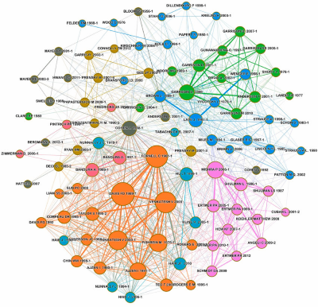

**Citation network** analysis is the process of examining the relationships and connections between academic papers, journals, or authors based on citations. In this network, nodes represent papers or authors, and edges represent citations from one paper to another. By analyzing citation patterns, one can uncover important insights such as influential papers, key authors, the structure of research fields, collaboration patterns, and trends over time. This analysis helps identify central works, predict future research directions, and evaluate the impact of scholarly contributions.

---

### Dataset
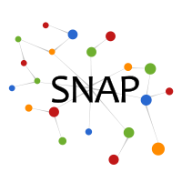
[SNAP Dataset Link](https://snap.stanford.edu/data/#citnets)

The data used in this analysis is sourced from the **SNAP dataset**, which initially contained **27,770 nodes** and **352,807 edges**. To facilitate manageable computations and draw meaningful inferences, We selected a subset of **1,000 nodes** and **12,944 edges**.

Additionally, the dataset includes text documents associated with each node. We performed **text preprocessing** on these documents, extracting and highlighting the most relevant portions of text to effectively showcase the content of each document. This enables a more focused analysis while preserving the essential information.

|Text Before | Text File After Processing |
|-|-|
|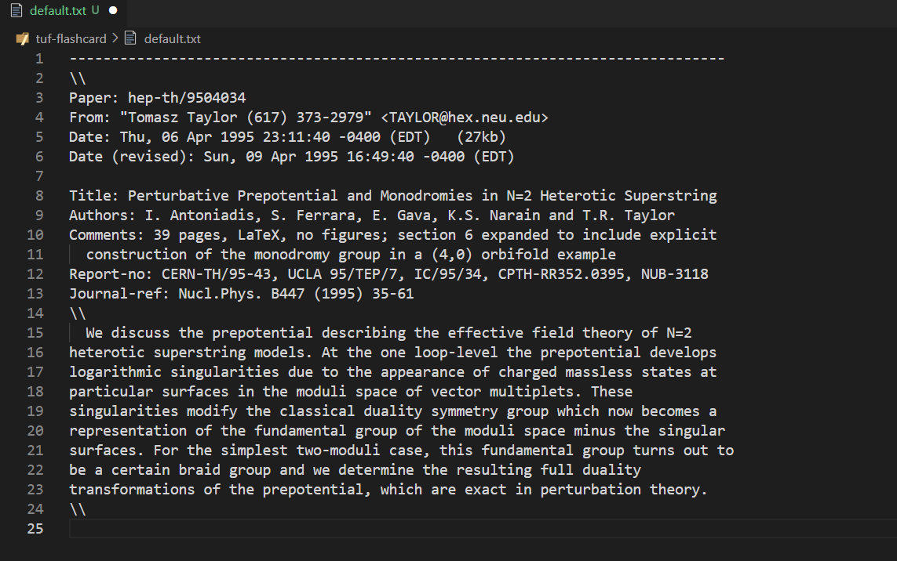| 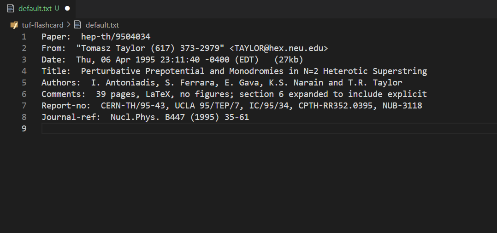 |

---

### Functions in Citation Network Analysis

1. [**degreeDistribution**](#Degree-Distribution)  
   Analyzes the distribution of node degrees (number of connections) in the network to understand its structure.

2. [**localClusteringCoefficient**](#main-section)  
   Measures the local clustering of a node, i.e., how interconnected its neighbors are.

3. [**globalClusteringCoefficient**](#main-section)  
   Calculates the overall clustering coefficient of the network, reflecting the tendency of nodes to cluster together.

4. [**bfs**](#main-section)  
   Implements a breadth-first search (BFS) algorithm to explore the graph starting from a source node.

5. [**connectedComponents**](#main-section)  
   Identifies and separates the connected components of the graph, which are subsets of nodes that are connected.

6. [**degreeCentrality**](#main-section)  
   Computes the degree centrality of each node, which measures the number of direct connections a node has.

7. [**closenessCentrality**](#main-section)  
   Measures how close a node is to all other nodes in the network based on the shortest path.

8. [**eigenVectorCentrality**](#main-section)  
   Computes the eigenvector centrality, which determines the influence of a node based on its connections' influence.

9. [**diameter**](#main-section)  
   Calculates the diameter of the network, which is the longest shortest path between any two nodes.

10. [**bfsDis**](#main-section)  
    Computes the BFS distance matrix for a given source node, capturing distances from the source to all other nodes.

11. [**katzCentrality**](#main-section)  
    A variant of centrality that considers both the number and the quality of a node's neighbors.

12. [**pageRank**](#main-section)  
    Implements the PageRank algorithm, commonly used to rank nodes based on their importance in the network.

13. [**calculateDensity**](#main-section)  
    Computes the density of the network, indicating how many edges exist compared to the maximum possible edges.

14. [**calculateHubAuth**](#main-section)  
    Calculates hub and authority scores, which are used to evaluate the significance of nodes in link-based networks.

15. [**countBidirectionalEdges**](#main-section)  
    Counts the number of bidirectional edges in the network, which are edges that go both ways between nodes.

16. [**calculateReciprocity**](#main-section)  
    Measures the reciprocity of the network, which is the proportion of directed edges that are mutual.

17. [**linkPredClusteringCoeff**](#main-section)  
    Predicts future links between nodes based on clustering coefficients.

18. [**simRank**](#main-section)  
    Computes the similarity between two nodes based on their structure and connectivity.

19. [**CosineSim**](#main-section)  
    Calculates the cosine similarity between two nodes using their connection vectors.

20. [**modularity**](#main-section)  
    Measures the modularity of a network’s community structure, assessing how well-defined the communities are.

21. [**purity**](#main-section)  
    Evaluates the quality of community detection by comparing the detected communities with ground truth labels.

22. [**omegaIndex**](#main-section)  
    Computes the Omega Index to evaluate the overlap of two community structures.

23. [**internalClusteringCoefficient**](#main-section)  
    Calculates the internal clustering coefficient for a node within a community.

24. [**calculatePermanence**](#main-section)  
    Measures the permanence of nodes in communities, determining the stability of a community's structure over time.

---
### Outputs

##### 1. Degree Distribution
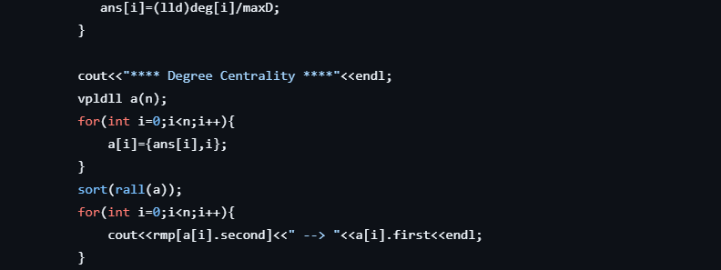 

##### 2. Local Clustering Coefficient
 

##### 3. Global Clustering Coefficient
 

##### 4. BFS
 

##### 5. Connected Components
 

##### 6. Degree Centrality
 

##### 7. Closeness Centrality
 

##### 8. Eigen Vector Centrality
 

##### 9. Diameter
 

##### 10. Bfs Dis
 

##### 11. Katz Centrality
 

##### 12. PageRank
 

##### 13. Calculate Density
 

##### 14. Calculate Hub Auth
 

##### 15. Calculate Reciprocity
 

##### 16. Link Prediction  Clustering Coefficient
 

##### 17. SimRank
 

##### 18. Cosine Similarity
 

##### 19. Modularity
 

##### 20. Purity
 

##### 21. Omega Index
 

##### 22. Internal Clustering Coefficient
 

##### 23. Calculate Permanence
 

---


### Comparison with Gephi 

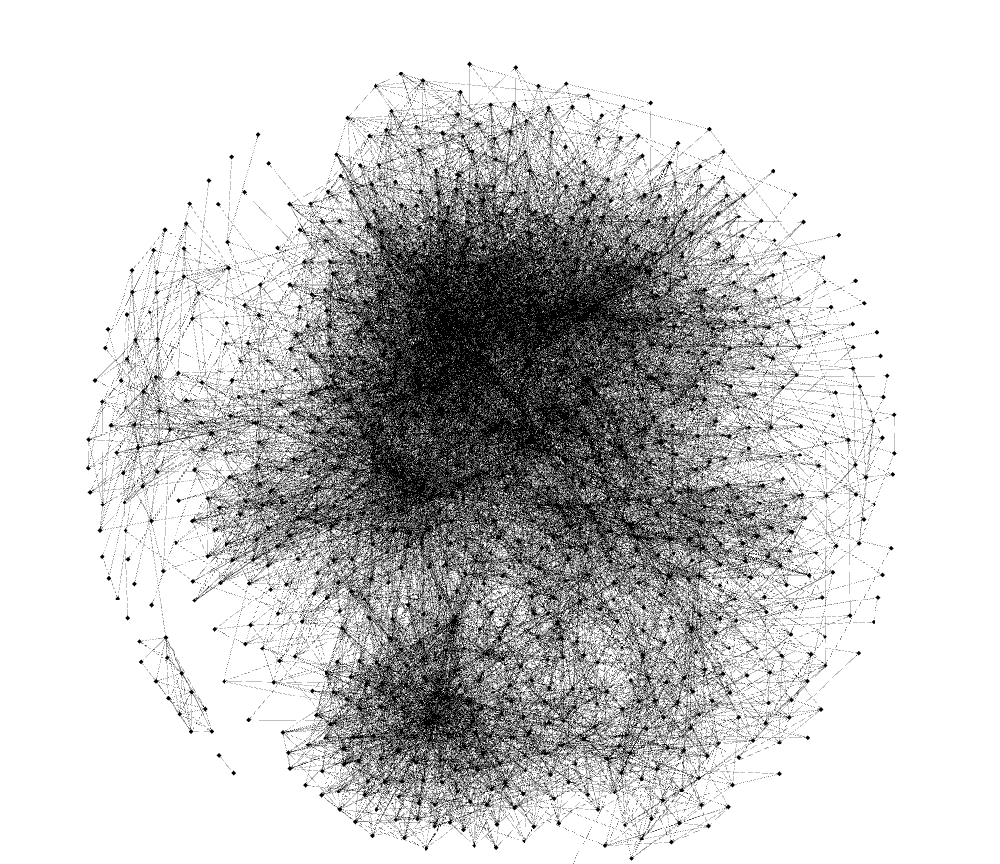 

**Fruchterman-Reingold**

#### 1. Average Clustering Cofficient
| Output from Code | Gephi Output |
|-|-|
|  | 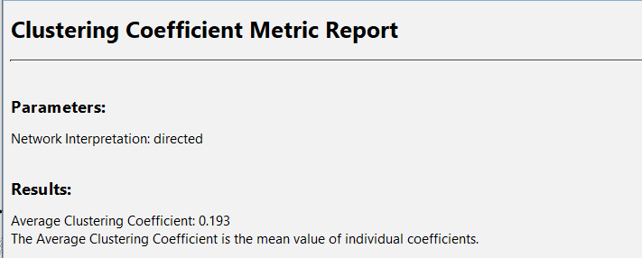 |

#### 2. Connected Component
| Output from Code | Gephi Output |
|-|-|
|  | 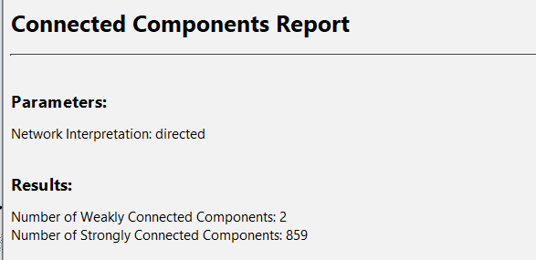 |

#### 3. Density
| Output from Code | Gephi Output |
|-|-|
|  | 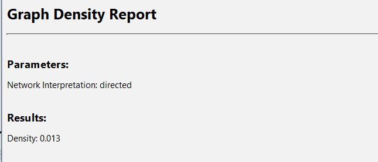 |

#### 4. EigenVector
| Output from Code | Gephi Output |
|-|-|
|  | 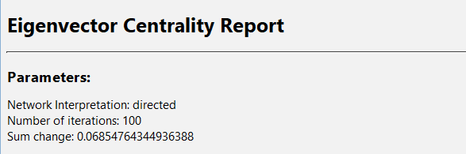 |

#### 5. Modularity
| Output from Code | Gephi Output |
|-|-|
|  | 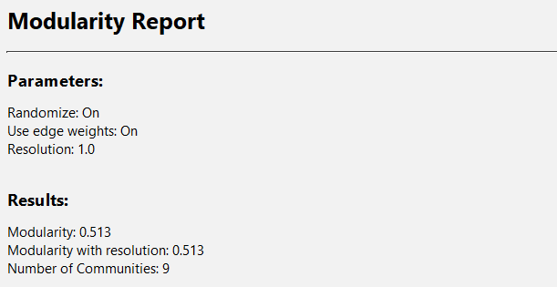 |

#### 6. PageRank
| Output from Code | Gephi Output |
|-|-|
|  | 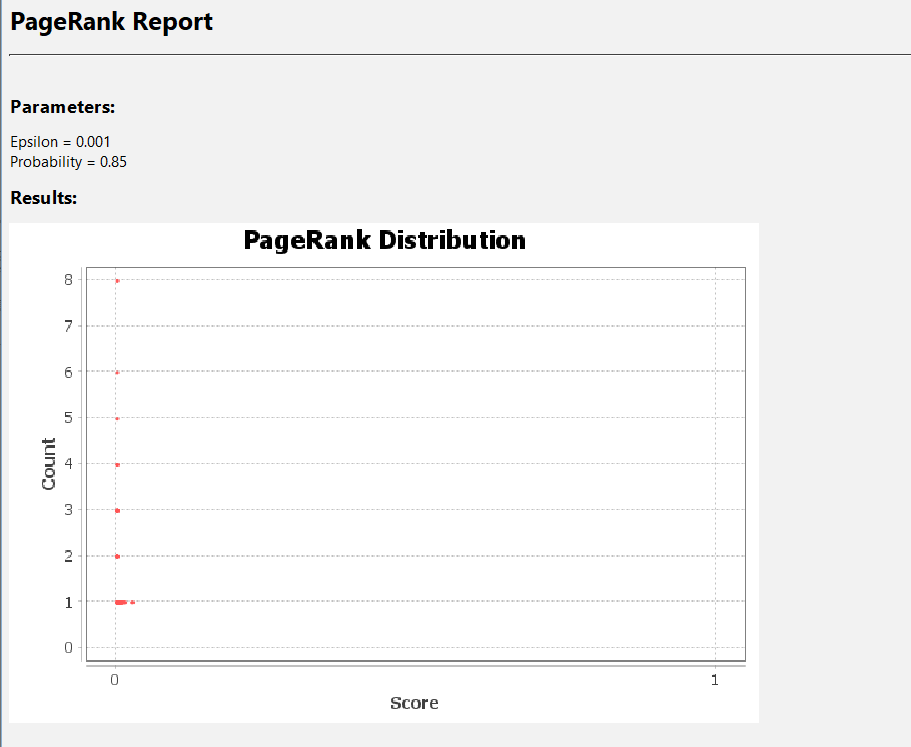 |

---


### Functions  Signature in Graph Class
```cpp
1. void degreeDistribution()
2. void localClusteringCoefficient()       
3. void globalClusteringCoefficient()
4. void bfs(ll src,vll& vis)       
5. void connectedComponents()      
6. void degreeCentrality()     
7. void closenessCentrality()
8. void eigenVectorCentrality(ll show=0,ll rank=5)void diameter()
9. vvll bfsDis(ll src)
10. void katzCentrality(ll show=0,ll rank=5) 
11. void pageRank(ll show=0,ll rank=5,ll iterations=7)
12. void calculateDensity() 
13. void calculateHubAuth(int maxIterations = 100, lld tol = 1e-5) 
14. int countBidirectionalEdges()
15. void calculateReciprocity()
16. void linkPredClusteringCoeff(ll A,ll B)
17. void simRank(ll A,ll B)
18. void CosineSim(vvll t)
19. void modularity(vvll comm)
20. void purity(ll V,vvll detected, vvll groundTruth)
21. void omegaIndex(ll V,vvll detected, vvll groundTruth)
22. lld internalClusteringCoefficient(ll node, vll &communityNodes,  map<ll, vector<ll>> &graph)
23. lld calculatePermanence(ll node,vll &communityNodes,map<ll, vll> &graph,map<ll, ll> &nodeToCommunity)
24. void permanence()
```
---

#### Team
|Sl | Name | Roll Number |
|-|-|-|
|1| Akshat Jain | 205123010 |
|2| Hari Mohan | 205123038 |
|3| Rahul Kumar | 205123078 |
|4| Rahul Kumar Sah | 205123080 |